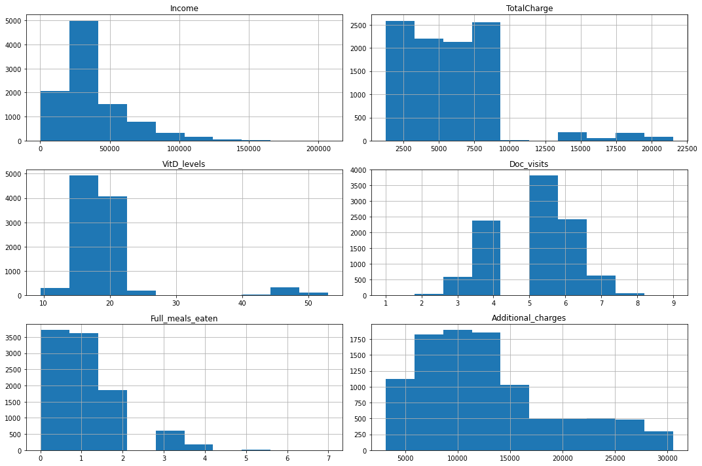
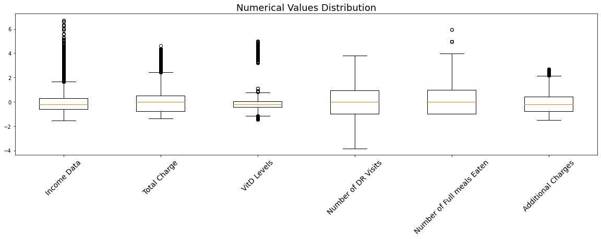
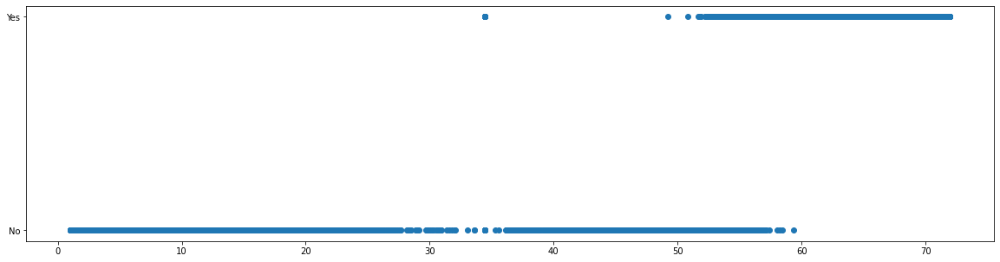

# D206 Data Cleaning
#### By: Orland Cole Malphrus
#### 5/2/2021

## PART I: Research Question
#### A:  Describe one question or decision that you will address using the data set you chose.
 Can we accurately predict which individual patients are likey to require redamission based on their patient profile? That is, can we create a model that will identify the likleyhood of readmission based on data collected during the initial visit? Furthermore to address this question, we must address the question of which individual data features correlate with the readmission rate.

### B: Describe the variables in the data set 

The data set contains 10,000 patient records from a hospital that hopes to assess the likelihood of patient readmission. The data set contains a column labeled “ReAdmis” which is the target variable in the analysis. The Readmission data point is a categorical variable that is boolean. The readmission data point reads “yes” if the patient was readmitted to the hospital within a month. 

The data set is also comprised of many other independent variables that must be considered. These variables will be assessed to determine potential predictors of our target variable. These variables fall into four main categories.

1. Patient medical condition: medical condition data points are primarily categorical and contain boolean “yes/no” or “0/1” values. For example, the data set contains a “BackPain” column where if the patient has back chronic back pain the column would contain a “yes” value and if the patient does not have chronic back pain the value would be “no”. high blood pressure, stroke, obesity, arthritis, diabetes, and a few others follow this same pattern. The “VitD_levels” column is an example of an exception to this pattern as this data column Mesures Vitamine D levels as a numerical value.
2. Patient Information: patient information columns are columns that contain information about the patient’s stay. This includes information such as the type of initial admission, treatments received, and the number of days hospitalized. The patient information contains categorical data exemplified by the type of initial admission which is broken down into three categories “emergency admission”, “elective admission”, “observation”. The patient information also contains numerical data such as the number of days hospitalized which contains a count of the number of days the patient stayed in the hospital.
3. patient demographic information: the patient demographic data includes items such as the geographic location, income level, age, and regional population. This data categorical data based such as the country of residence on the patients billing address as well as numerical data such as the income of the patient.
4. Survey Data: The survey data contains 8 questions about the perceived importance of certain aspects of the hospital experience. The data points are stored as numerical ratings on a scale of 1 to 8 with 1 being most important and being the least important.


## Part II: Data Cleaning Plan

### C: Explain the plan for cleaning the data by doing the following:

#### C1. The Approach that will be used to discover anomalies in the data:
1. The data will be imported from the CSV file and into a python pandas DataFrame.
2. The data labels will be identified and checked for alignment with the data dictionary provided by the hospital.
3. A new Index field will be created if one is not satasfoctoraly provided in the pre existing data set.
4. Check for duplicate data entries in the dataframe using pandas build in duplicated method.
5. Check categorical data for consistency in category labels. Using the unique method to determine the categories 
6. The data sets columns will be scanned to discover columns with missing values. These columns will be noted for further action when it comes to mitigating abnormalities. This will be done using pandas built in null and na checking.
7. Columns in the data frame that contain numerical values will be anylized In two separate ways. First the numerical values will be plotted in a histogram. Secondly the data will be standardized and then plotted using matplotlib’s box plot functionality. This will aim to identify columns with outliers that could potentially be anomalies. 
8. The 8 survey items in the data set will be anylized separately from the other numerical values. Since the data dictionary specifies the range of values allowed on the survey as numbers between one and 8 we can scan for anomalies with a pandas min and max functions.


```python
# TODO justification of aproach
```


```python
# TODO justification of tools
```

#### C4: Code 


```python
import numpy as np
import pandas as pd
import matplotlib.pyplot as plt
import scipy.stats as stats
```


```python
# using pandas read_csv method we are able to read in the data from the csv file
# by setting pd options we are able to ensure that our data columns are not truncated allowing 
# us to be able to view all columns provided
df = pd.read_csv('./medical_raw_data.csv')
pd.set_option('display.max_columns', 55)
```


```python
# by utilizing the dataframes head method we can view the first 5 rows of our dat aframe
df.head()
```


<div>
<style scoped>
    .dataframe tbody tr th:only-of-type {
        vertical-align: middle;
    }

    .dataframe tbody tr th {
        vertical-align: top;
    }

    .dataframe thead th {
        text-align: right;
    }
</style>
<table border="1" class="dataframe">
  <thead>
    <tr style="text-align: right;">
      <th></th>
      <th>Unnamed: 0</th>
      <th>CaseOrder</th>
      <th>Customer_id</th>
      <th>Interaction</th>
      <th>UID</th>
      <th>City</th>
      <th>State</th>
      <th>County</th>
      <th>Zip</th>
      <th>Lat</th>
      <th>Lng</th>
      <th>Population</th>
      <th>Area</th>
      <th>Timezone</th>
      <th>Job</th>
      <th>Children</th>
      <th>Age</th>
      <th>Education</th>
      <th>Employment</th>
      <th>Income</th>
      <th>Marital</th>
      <th>Gender</th>
      <th>ReAdmis</th>
      <th>VitD_levels</th>
      <th>Doc_visits</th>
      <th>Full_meals_eaten</th>
      <th>VitD_supp</th>
      <th>Soft_drink</th>
      <th>Initial_admin</th>
      <th>HighBlood</th>
      <th>Stroke</th>
      <th>Complication_risk</th>
      <th>Overweight</th>
      <th>Arthritis</th>
      <th>Diabetes</th>
      <th>Hyperlipidemia</th>
      <th>BackPain</th>
      <th>Anxiety</th>
      <th>Allergic_rhinitis</th>
      <th>Reflux_esophagitis</th>
      <th>Asthma</th>
      <th>Services</th>
      <th>Initial_days</th>
      <th>TotalCharge</th>
      <th>Additional_charges</th>
      <th>Item1</th>
      <th>Item2</th>
      <th>Item3</th>
      <th>Item4</th>
      <th>Item5</th>
      <th>Item6</th>
      <th>Item7</th>
      <th>Item8</th>
    </tr>
  </thead>
  <tbody>
    <tr>
      <th>0</th>
      <td>1</td>
      <td>1</td>
      <td>C412403</td>
      <td>8cd49b13-f45a-4b47-a2bd-173ffa932c2f</td>
      <td>3a83ddb66e2ae73798bdf1d705dc0932</td>
      <td>Eva</td>
      <td>AL</td>
      <td>Morgan</td>
      <td>35621</td>
      <td>34.34960</td>
      <td>-86.72508</td>
      <td>2951</td>
      <td>Suburban</td>
      <td>America/Chicago</td>
      <td>Psychologist, sport and exercise</td>
      <td>1.0</td>
      <td>53.0</td>
      <td>Some College, Less than 1 Year</td>
      <td>Full Time</td>
      <td>86575.93</td>
      <td>Divorced</td>
      <td>Male</td>
      <td>No</td>
      <td>17.802330</td>
      <td>6</td>
      <td>0</td>
      <td>0</td>
      <td>NaN</td>
      <td>Emergency Admission</td>
      <td>Yes</td>
      <td>No</td>
      <td>Medium</td>
      <td>0.0</td>
      <td>Yes</td>
      <td>Yes</td>
      <td>No</td>
      <td>Yes</td>
      <td>1.0</td>
      <td>Yes</td>
      <td>No</td>
      <td>Yes</td>
      <td>Blood Work</td>
      <td>10.585770</td>
      <td>3191.048774</td>
      <td>17939.403420</td>
      <td>3</td>
      <td>3</td>
      <td>2</td>
      <td>2</td>
      <td>4</td>
      <td>3</td>
      <td>3</td>
      <td>4</td>
    </tr>
    <tr>
      <th>1</th>
      <td>2</td>
      <td>2</td>
      <td>Z919181</td>
      <td>d2450b70-0337-4406-bdbb-bc1037f1734c</td>
      <td>176354c5eef714957d486009feabf195</td>
      <td>Marianna</td>
      <td>FL</td>
      <td>Jackson</td>
      <td>32446</td>
      <td>30.84513</td>
      <td>-85.22907</td>
      <td>11303</td>
      <td>Urban</td>
      <td>America/Chicago</td>
      <td>Community development worker</td>
      <td>3.0</td>
      <td>51.0</td>
      <td>Some College, 1 or More Years, No Degree</td>
      <td>Full Time</td>
      <td>46805.99</td>
      <td>Married</td>
      <td>Female</td>
      <td>No</td>
      <td>18.994640</td>
      <td>4</td>
      <td>2</td>
      <td>1</td>
      <td>No</td>
      <td>Emergency Admission</td>
      <td>Yes</td>
      <td>No</td>
      <td>High</td>
      <td>1.0</td>
      <td>No</td>
      <td>No</td>
      <td>No</td>
      <td>No</td>
      <td>NaN</td>
      <td>No</td>
      <td>Yes</td>
      <td>No</td>
      <td>Intravenous</td>
      <td>15.129562</td>
      <td>4214.905346</td>
      <td>17612.998120</td>
      <td>3</td>
      <td>4</td>
      <td>3</td>
      <td>4</td>
      <td>4</td>
      <td>4</td>
      <td>3</td>
      <td>3</td>
    </tr>
    <tr>
      <th>2</th>
      <td>3</td>
      <td>3</td>
      <td>F995323</td>
      <td>a2057123-abf5-4a2c-abad-8ffe33512562</td>
      <td>e19a0fa00aeda885b8a436757e889bc9</td>
      <td>Sioux Falls</td>
      <td>SD</td>
      <td>Minnehaha</td>
      <td>57110</td>
      <td>43.54321</td>
      <td>-96.63772</td>
      <td>17125</td>
      <td>Suburban</td>
      <td>America/Chicago</td>
      <td>Chief Executive Officer</td>
      <td>3.0</td>
      <td>53.0</td>
      <td>Some College, 1 or More Years, No Degree</td>
      <td>Retired</td>
      <td>14370.14</td>
      <td>Widowed</td>
      <td>Female</td>
      <td>No</td>
      <td>17.415889</td>
      <td>4</td>
      <td>1</td>
      <td>0</td>
      <td>No</td>
      <td>Elective Admission</td>
      <td>Yes</td>
      <td>No</td>
      <td>Medium</td>
      <td>1.0</td>
      <td>No</td>
      <td>Yes</td>
      <td>No</td>
      <td>No</td>
      <td>NaN</td>
      <td>No</td>
      <td>No</td>
      <td>No</td>
      <td>Blood Work</td>
      <td>4.772177</td>
      <td>2177.586768</td>
      <td>17505.192460</td>
      <td>2</td>
      <td>4</td>
      <td>4</td>
      <td>4</td>
      <td>3</td>
      <td>4</td>
      <td>3</td>
      <td>3</td>
    </tr>
    <tr>
      <th>3</th>
      <td>4</td>
      <td>4</td>
      <td>A879973</td>
      <td>1dec528d-eb34-4079-adce-0d7a40e82205</td>
      <td>cd17d7b6d152cb6f23957346d11c3f07</td>
      <td>New Richland</td>
      <td>MN</td>
      <td>Waseca</td>
      <td>56072</td>
      <td>43.89744</td>
      <td>-93.51479</td>
      <td>2162</td>
      <td>Suburban</td>
      <td>America/Chicago</td>
      <td>Early years teacher</td>
      <td>0.0</td>
      <td>78.0</td>
      <td>GED or Alternative Credential</td>
      <td>Retired</td>
      <td>39741.49</td>
      <td>Married</td>
      <td>Male</td>
      <td>No</td>
      <td>17.420079</td>
      <td>4</td>
      <td>1</td>
      <td>0</td>
      <td>No</td>
      <td>Elective Admission</td>
      <td>No</td>
      <td>Yes</td>
      <td>Medium</td>
      <td>0.0</td>
      <td>Yes</td>
      <td>No</td>
      <td>No</td>
      <td>No</td>
      <td>NaN</td>
      <td>No</td>
      <td>Yes</td>
      <td>Yes</td>
      <td>Blood Work</td>
      <td>1.714879</td>
      <td>2465.118965</td>
      <td>12993.437350</td>
      <td>3</td>
      <td>5</td>
      <td>5</td>
      <td>3</td>
      <td>4</td>
      <td>5</td>
      <td>5</td>
      <td>5</td>
    </tr>
    <tr>
      <th>4</th>
      <td>5</td>
      <td>5</td>
      <td>C544523</td>
      <td>5885f56b-d6da-43a3-8760-83583af94266</td>
      <td>d2f0425877b10ed6bb381f3e2579424a</td>
      <td>West Point</td>
      <td>VA</td>
      <td>King William</td>
      <td>23181</td>
      <td>37.59894</td>
      <td>-76.88958</td>
      <td>5287</td>
      <td>Rural</td>
      <td>America/New_York</td>
      <td>Health promotion specialist</td>
      <td>NaN</td>
      <td>22.0</td>
      <td>Regular High School Diploma</td>
      <td>Full Time</td>
      <td>1209.56</td>
      <td>Widowed</td>
      <td>Female</td>
      <td>No</td>
      <td>16.870524</td>
      <td>5</td>
      <td>0</td>
      <td>2</td>
      <td>Yes</td>
      <td>Elective Admission</td>
      <td>No</td>
      <td>No</td>
      <td>Low</td>
      <td>0.0</td>
      <td>No</td>
      <td>No</td>
      <td>Yes</td>
      <td>No</td>
      <td>0.0</td>
      <td>Yes</td>
      <td>No</td>
      <td>No</td>
      <td>CT Scan</td>
      <td>1.254807</td>
      <td>1885.655137</td>
      <td>3716.525786</td>
      <td>2</td>
      <td>1</td>
      <td>3</td>
      <td>3</td>
      <td>5</td>
      <td>3</td>
      <td>4</td>
      <td>3</td>
    </tr>
  </tbody>
</table>
</div>


##### Observations after visual review of data structure
1. Their is an unamed row that apears in our data set containing an integer value. Although it apears to be an index row it would be unsave to make such an assumption as it does not show this in the data dictionary. There for to midigate confusion it will be removed. 
2. Their does not apear to be an index row in the data frame that adhears to the python convention of indexing begining with 0. due to this an index will be created and added to the dataframe.
3. The columns  "Overweight" and "Anxietey" store boolean values as 0 or 1. While this may be acceptable in many data sets it deviates from the standards set forth in the data dictionary. To mitigate this we will convert the 0 values to "no" and the 1 values to "yes" to better comply with the standards of the data set.


```python
# Removing the unnamed and unidentified  column from the dataset
# adding an "ID" column for reference thruout the cleaning process
df.drop(["Unnamed: 0","Interaction","UID","CaseOrder"], axis=1, inplace=True)
df["ID"] = pd.Series(range(0,10000))
```


```python
# Lising columns to insure the unnamed column has been fropped and the id column has been added
df.columns
```


    Index(['Customer_id', 'City', 'State', 'County', 'Zip', 'Lat', 'Lng',
           'Population', 'Area', 'Timezone', 'Job', 'Children', 'Age', 'Education',
           'Employment', 'Income', 'Marital', 'Gender', 'ReAdmis', 'VitD_levels',
           'Doc_visits', 'Full_meals_eaten', 'VitD_supp', 'Soft_drink',
           'Initial_admin', 'HighBlood', 'Stroke', 'Complication_risk',
           'Overweight', 'Arthritis', 'Diabetes', 'Hyperlipidemia', 'BackPain',
           'Anxiety', 'Allergic_rhinitis', 'Reflux_esophagitis', 'Asthma',
           'Services', 'Initial_days', 'TotalCharge', 'Additional_charges',
           'Item1', 'Item2', 'Item3', 'Item4', 'Item5', 'Item6', 'Item7', 'Item8',
           'ID'],
          dtype='object')


```python
# defined a dunction to convert digital booleans into strings complient with our data dictionary
# used pandas apply method and a lambda function to converet the "Anxiety" and "Overweight" columns to 
# a complient format
# Then reused the head method to ensure the change had been made sucsesfully
def digitalBool_to_string(s):
    if s == 1.0 or s == "Yes":
        return "Yes"
    elif s == 0.0 or s == "No":
        return "No"
    else:
        return np.nan

df["Anxiety"] = df["Anxiety"].apply(lambda s: digitalBool_to_string(s))
df["Overweight"] = df["Overweight"].apply(lambda s: digitalBool_to_string(s))
df.loc[:,["Anxiety", "Overweight"]]
```


<div>
<style scoped>
    .dataframe tbody tr th:only-of-type {
        vertical-align: middle;
    }

    .dataframe tbody tr th {
        vertical-align: top;
    }

    .dataframe thead th {
        text-align: right;
    }
</style>
<table border="1" class="dataframe">
  <thead>
    <tr style="text-align: right;">
      <th></th>
      <th>Anxiety</th>
      <th>Overweight</th>
    </tr>
  </thead>
  <tbody>
    <tr>
      <th>0</th>
      <td>Yes</td>
      <td>No</td>
    </tr>
    <tr>
      <th>1</th>
      <td>NaN</td>
      <td>Yes</td>
    </tr>
    <tr>
      <th>2</th>
      <td>NaN</td>
      <td>Yes</td>
    </tr>
    <tr>
      <th>3</th>
      <td>NaN</td>
      <td>No</td>
    </tr>
    <tr>
      <th>4</th>
      <td>No</td>
      <td>No</td>
    </tr>
    <tr>
      <th>...</th>
      <td>...</td>
      <td>...</td>
    </tr>
    <tr>
      <th>9995</th>
      <td>Yes</td>
      <td>NaN</td>
    </tr>
    <tr>
      <th>9996</th>
      <td>No</td>
      <td>Yes</td>
    </tr>
    <tr>
      <th>9997</th>
      <td>Yes</td>
      <td>Yes</td>
    </tr>
    <tr>
      <th>9998</th>
      <td>No</td>
      <td>Yes</td>
    </tr>
    <tr>
      <th>9999</th>
      <td>No</td>
      <td>Yes</td>
    </tr>
  </tbody>
</table>
<p>10000 rows × 2 columns</p>
</div>


```python

```

#### Check for Duplicate data 


```python
# using pandas dataframe duplicated method which sets a row to True if it is a duplicate and False if it is not
# then we use the value_counts method to determan the number of rows that evaluated to true
df.duplicated().value_counts()
```


    False    10000
    dtype: int64


#### Checking for consistency in Categorical Names


```python
# All unique categories seem consistent and without repeats
df["Education"].value_counts()
```


    Regular High School Diploma                 2444
    Bachelor's Degree                           1724
    Some College, 1 or More Years, No Degree    1484
    9th Grade to 12th Grade, No Diploma          832
    Associate's Degree                           797
    Master's Degree                              701
    Some College, Less than 1 Year               642
    Nursery School to 8th Grade                  552
    GED or Alternative Credential                389
    Professional School Degree                   208
    No Schooling Completed                       133
    Doctorate Degree                              94
    Name: Education, dtype: int64


```python
# All unique categories seem consistent and without repeats
df["Area"].value_counts()
```


    Rural       3369
    Suburban    3328
    Urban       3303
    Name: Area, dtype: int64


```python
df["Job"].value_counts()
```


    Outdoor activities/education manager     29
    Theatre director                         27
    Exhibition designer                      27
    Scientist, audiological                  26
    Estate agent                             25
                                             ..
    Engineer, control and instrumentation     6
    Phytotherapist                            6
    Licensed conveyancer                      6
    Public relations account executive        6
    Government social research officer        6
    Name: Job, Length: 639, dtype: int64


```python
# Asses the number of unique data sets
# the quantity and diversity is large enough on this categorical column that its 
#usefulness as it stands is in question bellow is the quantity of categories
len(df["Job"].unique())
```


    639


```python
# All unique categories seem consistent and without repeats
df["Employment"].unique()
```


    array(['Full Time', 'Retired', 'Unemployed', 'Student', 'Part Time'],
          dtype=object)


```python
# All unique categories seem consistent and without repeats
df["Marital"].unique()
```


    array(['Divorced', 'Married', 'Widowed', 'Never Married', 'Separated'],
          dtype=object)


```python
# All unique categories seem consistent and without repeats
df["Complication_risk"].unique()
```


    array(['Medium', 'High', 'Low'], dtype=object)


```python
# All unique categories seem consistent and without repeats
df["Services"].unique()
```


    array(['Blood Work', 'Intravenous', 'CT Scan', 'MRI'], dtype=object)


### searching for missing values in data


```python
# Gathering the sum of all null values by column
# Filtering out columns that have a count of 0 indicating no null values found
# displaying the number of rows with null values by column
count_of_null_by_column = df.isnull().sum()
nonzero = count_of_null_by_column > 0
count_of_null_by_column[nonzero]
```


    Children        2588
    Age             2414
    Income          2464
    Soft_drink      2467
    Overweight       982
    Anxiety          984
    Initial_days    1056
    dtype: int64


```python
# Calculating the percentage of null values in each row
# Filtering out columns that have a count of 0 indicating no null values found
# displaying the percentage of rows with null values by column
percentage_of_null_by_column = (df.isnull().sum() / 10000) * 100
nonzero = percentage_of_null_by_column > 0

percentage_of_null_by_column[nonzero]
```


    Children        25.88
    Age             24.14
    Income          24.64
    Soft_drink      24.67
    Overweight       9.82
    Anxiety          9.84
    Initial_days    10.56
    dtype: float64


#### Mitigation of missing variable
Unfortunatly our data set is missing a large amount of data. Do to this we are forced to employ mitigation tactics to ensure our future anylasis is not adversly affected. We will do this in the following ways.
1. The "Overweight","Anxiety", "Soft_drink" columns all contain boolean values of either yes or no. for theas columns we will add a third categorical options which is "Unknown". The reason for this choice is the large percentage off missing data. Imputing the most common of the boolean values could greatly skew mesears of central tendency and imputing yes no values based on known distrabutions would create unwanted noise in the data. The new unknown category may also be its own valid point of interest in the data as patterns may apear aound the missing information.
2. "Children","Age", "Income", "Initial_days" For the Income and Inital_Days columns we will impute the median value in the place of missing data. This will allow for statistical anylasis to be preformed. The Children and Age columns will be converted to categorical data because the amount of data missing is not acceptable. This will allow us to avoid discarding the data due to the nearly 25% NaN rate by creating an "Unknown" category.


```python
# using pandas describe function to asses the data before midigation
df.loc[:,["Overweight","Anxiety", "Soft_drink"]].describe()
```


<div>
<style scoped>
    .dataframe tbody tr th:only-of-type {
        vertical-align: middle;
    }

    .dataframe tbody tr th {
        vertical-align: top;
    }

    .dataframe thead th {
        text-align: right;
    }
</style>
<table border="1" class="dataframe">
  <thead>
    <tr style="text-align: right;">
      <th></th>
      <th>Overweight</th>
      <th>Anxiety</th>
      <th>Soft_drink</th>
    </tr>
  </thead>
  <tbody>
    <tr>
      <th>count</th>
      <td>9018</td>
      <td>9016</td>
      <td>7533</td>
    </tr>
    <tr>
      <th>unique</th>
      <td>2</td>
      <td>2</td>
      <td>2</td>
    </tr>
    <tr>
      <th>top</th>
      <td>Yes</td>
      <td>No</td>
      <td>No</td>
    </tr>
    <tr>
      <th>freq</th>
      <td>6395</td>
      <td>6110</td>
      <td>5589</td>
    </tr>
  </tbody>
</table>
</div>


```python
df["Overweight"].fillna("Unknown", inplace=True)
df["Anxiety"].fillna("Unknown", inplace=True)
df["Soft_drink"].fillna("Unknown", inplace=True)
```


```python
#This code is the same as previously used to show percentages of missing values by rows
#used here to show the sucsess of midigation

# Calculating the percentage of null values in each row
# Filtering out columns that have a count of 0 indicating no null values found
# displaying the percentage of rows with null values by column
percentage_of_null_by_column = (df.isnull().sum() / 10000) * 100
nonzero = percentage_of_null_by_column > 0

percentage_of_null_by_column[nonzero]
```


    Children        25.88
    Age             24.14
    Income          24.64
    Initial_days    10.56
    dtype: float64


##### Midigation of missing numerical values


```python
# # using pandas describe function to asses the data before midigation
df.loc[:,["Children","Age", "Income", "Initial_days"]].describe()
```


<div>
<style scoped>
    .dataframe tbody tr th:only-of-type {
        vertical-align: middle;
    }

    .dataframe tbody tr th {
        vertical-align: top;
    }

    .dataframe thead th {
        text-align: right;
    }
</style>
<table border="1" class="dataframe">
  <thead>
    <tr style="text-align: right;">
      <th></th>
      <th>Children</th>
      <th>Age</th>
      <th>Income</th>
      <th>Initial_days</th>
    </tr>
  </thead>
  <tbody>
    <tr>
      <th>count</th>
      <td>7412.000000</td>
      <td>7586.000000</td>
      <td>7536.000000</td>
      <td>8944.000000</td>
    </tr>
    <tr>
      <th>mean</th>
      <td>2.098219</td>
      <td>53.295676</td>
      <td>40484.438268</td>
      <td>34.432082</td>
    </tr>
    <tr>
      <th>std</th>
      <td>2.155427</td>
      <td>20.659182</td>
      <td>28664.861050</td>
      <td>26.287050</td>
    </tr>
    <tr>
      <th>min</th>
      <td>0.000000</td>
      <td>18.000000</td>
      <td>154.080000</td>
      <td>1.001981</td>
    </tr>
    <tr>
      <th>25%</th>
      <td>0.000000</td>
      <td>35.000000</td>
      <td>19450.792500</td>
      <td>7.911709</td>
    </tr>
    <tr>
      <th>50%</th>
      <td>1.000000</td>
      <td>53.000000</td>
      <td>33942.280000</td>
      <td>34.446941</td>
    </tr>
    <tr>
      <th>75%</th>
      <td>3.000000</td>
      <td>71.000000</td>
      <td>54075.235000</td>
      <td>61.124654</td>
    </tr>
    <tr>
      <th>max</th>
      <td>10.000000</td>
      <td>89.000000</td>
      <td>207249.130000</td>
      <td>71.981486</td>
    </tr>
  </tbody>
</table>
</div>


```python
# using pandas build in fill na method to replace missing values with the median value of the column
df["Income"].fillna(df["Income"].median(), inplace=True)
df["Initial_days"].fillna(df["Initial_days"].median(), inplace=True)

```


```python
# define a function to break down numerical "Children" data into categorical data
def number_of_children_categories(s):
    if type(s) == str:
        return s
        
    if s == 0:
        return "None"
    elif s <= 2:
        return "1-2"
    elif s < 6:
        return "3-5"
    elif s >= 6:
        return "6+"

# Convert numerical value of children to a categorical value
df["Children"] = df["Children"].apply(lambda s: number_of_children_categories(s))
# replacing missing values in data to "Unknown"
df["Children"].fillna( "Unknown", inplace=True)

# Display Children column to check for desired outcomes
df["Children"]
```


    0           1-2
    1           3-5
    2           3-5
    3          None
    4       Unknown
             ...   
    9995    Unknown
    9996        3-5
    9997        3-5
    9998        3-5
    9999         6+
    Name: Children, Length: 10000, dtype: object


```python
# define a function to break down numerical "Age" data into categorical data
def age_to_categories(s):
    if type(s) == str:
        return s
        
    if s < 30:
        return "0-29"
    elif s < 50:
        return "30-49"
    elif s < 70:
        return "50-69"
    elif s >= 70 :
        return "70+"

# Convert numerical value of age to a categorical value
df["Age"] = df["Age"].apply(lambda s: age_to_categories(s))
# replacing missing values in data to "Unknown"
df["Age"].fillna( "Unknown", inplace=True)

# Display Age column to check for desired outcomes
df["Age"]
```


    0         50-69
    1         50-69
    2         50-69
    3           70+
    4          0-29
             ...   
    9995       0-29
    9996        70+
    9997    Unknown
    9998      30-49
    9999    Unknown
    Name: Age, Length: 10000, dtype: object


```python
#This code is the same as previously used to show percentages of missing values by rows
#used here to show the sucsess of midigation

# Calculating the percentage of null values in each row
# Filtering out columns that have a count of 0 indicating no null values found
# displaying the percentage of rows with null values by column
percentage_of_null_by_column = (df.isnull().sum() / 10000) * 100
nonzero = percentage_of_null_by_column > 0

percentage_of_null_by_column[nonzero]
```


    Series([], dtype: float64)


#### Discover of Outliers


```python
# Create histograms Numerical values to identify outliers
# Using pandas and matplot lib
plots = df[['Income', "TotalCharge","VitD_levels", "Doc_visits", "Full_meals_eaten", "Additional_charges"]].hist(figsize=(15, 10))
plt.tight_layout()
plt.show()
```


    

    


```python

```


```python
# 1. Standardize all numerical data
# 2. Use Box Plots of all numerical data to observe outliers

std_income_data = (df["Income"] - df["Income"].mean()) /df["Income"].std()
std_total_charge = (df["TotalCharge"] - df["TotalCharge"].mean()) /df["TotalCharge"].std()
std_vitd_data = (df["VitD_levels"] - df["VitD_levels"].mean()) /df["VitD_levels"].std()
std_docvisit_data = (df["Doc_visits"] - df["Doc_visits"].mean()) /df["Doc_visits"].std()
std_Full_meals_eaten = (df["Full_meals_eaten"] - df["Full_meals_eaten"].mean()) /df["Full_meals_eaten"].std()
std_Additional_charges = (df["Additional_charges"] - df["Additional_charges"].mean()) /df["Additional_charges"].std()

plt.figure(figsize=(20,5)) 
plt.title("Numerical Values Distribution", size=18)
plt.boxplot([
    std_income_data,
    std_total_charge,
    std_vitd_data,
    std_docvisit_data,
    std_Full_meals_eaten, # Concerned that this is mearly a function of time in hospital
    std_Additional_charges
]) 
plt.xticks(
    [1,2,3,4,5, 6],
    [
    "Income Data",
    "Total Charge",
    "VitD Levels",
    "Number of DR Visits",
    "Number of Full meals Eaten",
    "Additional Charges"
    ],
    rotation=45,
    size=14
           
)
plt.show()
```


    

    


#### Survey Item Check
Survey questions are allowed contain integer values between 1 and 8. This check will determin that no values exist outside of those constraints


```python
# This query shows that all values are accounted for in the "count" row
# the min and max indicates that the max and min value in each row is within the acceptable range

df.loc[:, "Item1":"Item8"].describe().iloc[[0,3,-1]]
```


<div>
<style scoped>
    .dataframe tbody tr th:only-of-type {
        vertical-align: middle;
    }

    .dataframe tbody tr th {
        vertical-align: top;
    }

    .dataframe thead th {
        text-align: right;
    }
</style>
<table border="1" class="dataframe">
  <thead>
    <tr style="text-align: right;">
      <th></th>
      <th>Item1</th>
      <th>Item2</th>
      <th>Item3</th>
      <th>Item4</th>
      <th>Item5</th>
      <th>Item6</th>
      <th>Item7</th>
      <th>Item8</th>
    </tr>
  </thead>
  <tbody>
    <tr>
      <th>count</th>
      <td>10000.0</td>
      <td>10000.0</td>
      <td>10000.0</td>
      <td>10000.0</td>
      <td>10000.0</td>
      <td>10000.0</td>
      <td>10000.0</td>
      <td>10000.0</td>
    </tr>
    <tr>
      <th>min</th>
      <td>1.0</td>
      <td>1.0</td>
      <td>1.0</td>
      <td>1.0</td>
      <td>1.0</td>
      <td>1.0</td>
      <td>1.0</td>
      <td>1.0</td>
    </tr>
    <tr>
      <th>max</th>
      <td>8.0</td>
      <td>7.0</td>
      <td>8.0</td>
      <td>7.0</td>
      <td>7.0</td>
      <td>7.0</td>
      <td>7.0</td>
      <td>7.0</td>
    </tr>
  </tbody>
</table>
</div>


```python
# this query shows the data type and the counts
df.loc[:, "Item1":"Item8"].info()
```

    <class 'pandas.core.frame.DataFrame'>
    RangeIndex: 10000 entries, 0 to 9999
    Data columns (total 8 columns):
     #   Column  Non-Null Count  Dtype
    ---  ------  --------------  -----
     0   Item1   10000 non-null  int64
     1   Item2   10000 non-null  int64
     2   Item3   10000 non-null  int64
     3   Item4   10000 non-null  int64
     4   Item5   10000 non-null  int64
     5   Item6   10000 non-null  int64
     6   Item7   10000 non-null  int64
     7   Item8   10000 non-null  int64
    dtypes: int64(8)
    memory usage: 625.1 KB
    

## END OF PRODUCTION


```python
plt.figure(figsize=(20,5))
plt.scatter(df["Initial_days"], df["ReAdmis"])
# plt.scatter(df["Age"], df["ReAdmis"], c="Yellow")
plt.show()
```


    

    


```python

```


```python

```
